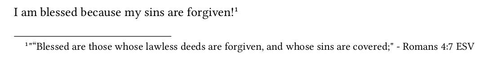

# Typst Bible

## Explanation

- Reference Bible verses
- ESV is currently only translation
- Many changes and improvements are planned
- Currently just puts the verse content in a footnote

## Usage

`bible.typ` is meant to provide an API for interacting with `bible.wasm`

### Import `bible.typ`

This includes `r` which is currently how you reference a verse

```typ
import "bible.typ": r
```

### Calling

```typ
I am blessed because my sins are forgiven! #r("Romans 4:7")
```

### Result



### Extra Information

I will try and provide clear naming conventions, and they might be a bit verbose.
However, you can just rename them as follows:
```typ
#let v = set_verse_content_in_footnote
// ...
#v("1 John 3:2")
```
This is a made up example, but you get the point.

## Building

To build:

```bash
wasm-pack build --target web
```

I use a script that deletes and re-links the file so that Typst knows to re-check the contents:

```bash
./run.sh
```
