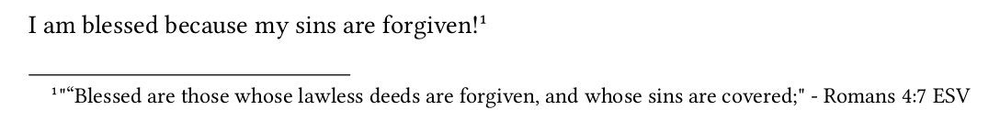
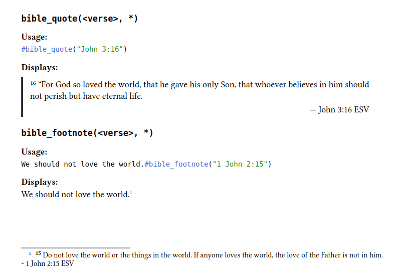

# Typst Bible

## Explanation

- Reference Bible verses
- ESV is currently only translation
- Many changes and improvements are planned
- Currently just puts the verse content in a footnote

## Usage

`bible.typ` is meant to provide an API for interacting with `bible.wasm`

### Import `bible.typ`

This includes `r` which is currently how you reference a verse

```typ
import "bible.typ": bible_footnote, bible_quote, bible_quote_fmt
```

## `bible_footnote`

### Calling

```typ
I am blessed because my sins are forgiven! #bible_footnote("Romans 4:7")
// or
I am blessed because my sins are forgiven! ^ Romans 4:7
```

### Result



## `bible_quote`

### Calling

```typ
#bible_quote("Romans 4:7")
// or
> Romans 4:7
```

### Result


## `bible_quote_fmt`

### Calling

#### Basic

This is just like using `#bible_quote` with no additional formatting applied

```typ
#bible_quote_fmt("Ephesians 4:28")
```

#### Bold

```typ
#bible_quote_fmt("Ephesians 4:28", b: "")
```

#### `hl`   = highlight match pattern
#### `ul`   = underline match pattern
#### `it`   = italics match pattern
#### `b`    = bold match pattern
#### `c`    = custom match pattern to apply `fmt` filter
#### `fmt`  = custom formatting pattern
#### `omit` = omit content by replacing with elipse ...


### Extra Information

I will try and provide clear naming conventions, and they might be a bit verbose.
However, you can just rename them as follows:
```typ
#let v = set_verse_content_in_footnote
// ...
#v("1 John 3:2")
```
This is a made up example, but you get the point.

## Building WASM

To build:

```bash
wasm-pack build --target web
```

I use a script that deletes and re-links the file so that Typst knows to re-check the contents:

```bash
./run.sh
```

## Screenshots

